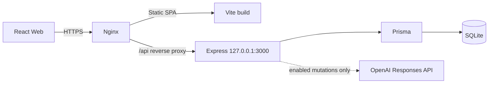

# MCM Journey Passport

> 고객의 온라인 취향과 매장에서의 실제 선택을 연결해, 자신만의 MCM Journey를 완성하는 인터랙티브 리테일 서비스

**Production**: [https://1.201.116.12](https://1.201.116.12)

**API Health**: [https://1.201.116.12/api/health](https://1.201.116.12/api/health)

## 서비스 소개

MCM Journey Passport는 고객의 취향과 매장에서의 실제 선택에 따라 AI가 다음 제품, 탐색 구역, 추천 이유와 이야기 흐름을 변화시키며 자신만의 MCM Journey를 완성하도록 돕습니다.

고객은 온라인 관심 정보와 시작 질문을 기반으로 Journey를 시작하고, 매장에서 실제 제품을 비교하고 선택합니다. 각 선택과 거절은 다음 추천에 반영되며, 마지막에는 최종 제품을 연결한 `Journey Signature`와 `Final Look`을 제공합니다.

브랜드의 기존 매장, 팝업, 행사를 개인화된 탐색 경험으로 확장해 고객이 미처 알지 못했던 MCM 제품과 스타일을 발견하고 브랜드를 새로운 방식으로 기억하게 하는 것이 목표입니다.

## 문제와 타깃

### 해결하려는 문제

- 다양한 MCM 제품과 스타일을 발견할 접점이 부족합니다.
- 고객별 취향이 매장 경험에 충분히 반영되지 않습니다.
- 온라인 관심과 오프라인의 실제 선택이 단절되어 있습니다.
- 브랜드를 새롭게 경험하고 기억할 참여형 접점이 부족합니다.

### Primary

MCM은 알고 있지만 다양한 제품과 스타일을 충분히 경험하지 않은 20대 고객입니다. 패션과 자기표현에 관심이 있고, 단순 구매보다 개인화된 브랜드 경험을 중요하게 생각합니다.

### Secondary

MCM을 처음 접하거나 브랜드 이미지가 아직 뚜렷하지 않은 젊은 고객입니다. 자신의 취향과 선택을 통해 MCM의 제품군을 자연스럽게 탐색합니다.

## Demo Flow

```text
Login
  -> Consent / Profile
  -> Reservation
  -> Start Question
  -> Passport
  -> Check-in
  -> INTRO
  -> BAG
  -> APPAREL
  -> ACCESSORY
  -> Journey Result
  -> AR Try-on
```

현재 MVP Journey는 정확히 `BAG -> APPAREL -> ACCESSORY -> RESULT` 순서입니다. `SHOES` 5개는 향후 확장을 위해 Product와 Inventory에만 등록되어 있으며 추천, Progress, Result, AR 및 고객 UI에는 노출되지 않습니다.

## 핵심 기능

### 방문 전 고객 경험

- 데모 고객 로그인과 데이터 활용 동의
- 시드 기반 TasteProfile 및 선호 태그 확인
- 매장과 방문 일시 선택, 시작 질문 응답
- 멱등적인 Reservation 생성과 Passport 발급
- 수동 예약 코드 기반 매장 Check-in

### 매장 Journey

- `READY -> ACTIVE -> FINISHED` 상태 전이
- BAG, APPAREL, ACCESSORY 단계별 최대 3개 제품 추천
- 제품 선택, 선택 변경, 선택 취소, 거절 interaction 저장
- 서버 aggregate 기반 새로고침 및 서버 재시작 복구
- 중복 start, interaction, next, finish 요청에 대한 멱등 처리
- 완료 후 Journey Signature, Final Look, 제품별 추천 이유 제공
- 공개 Share 화면과 로그인 없는 공유 링크

### AI 추천과 안전장치

- OpenAI Responses API 기반 텍스트 AI
- TasteProfile snapshot, 시작 질문, 이전 선택 및 거절을 반영한 단계별 추천
- BAG, APPAREL, ACCESSORY 추천 순서와 추천 이유, Journey narrative 생성
- 최종 Journey Signature, story, Final Look, 제품별 이유 및 `staffSummary` 생성
- 서버가 재고, 매장, zone, category 조건으로 후보를 먼저 제한하고 AI는 허용된 후보 안에서만 선택
- strict Structured Outputs와 Zod 구조/의미 검증
- timeout, provider 오류, 검증 실패 또는 AI 비활성 시 deterministic fallback
- AI 호출과 저장 transaction을 분리하고, 확정 결과 및 최소 AIExecution 요약을 함께 저장
- GET, 새로고침, Result/Share/Staff 조회에서는 AI를 다시 호출하지 않음

이미지 생성 AI는 최종 구현에서 사용하지 않습니다. Result의 네 번째 editorial 비주얼은 정적 asset인 `/assets/journey-result/editorial-look.png`를 사용합니다.

## Product Catalog

Production에는 Product 41개와 Inventory 41개가 등록되어 있습니다.

| 구분 | BAG | APPAREL | ACCESSORY | SHOES | 합계 |
| --- | ---: | ---: | ---: | ---: | ---: |
| 기존 demo | 3 | 3 | 3 | 0 | 9 |
| 신규 MCM collection | 14 | 9 | 4 | 5 | 32 |
| 전체 | 17 | 12 | 7 | 5 | 41 |

- BAG 17개, APPAREL 12개, ACCESSORY 7개가 현재 Journey 후보 및 AR 카탈로그에 연결됩니다.
- SHOES 5개는 DB와 Inventory에만 보관하고 현재 3단계 Journey에서는 제외합니다.
- 등록된 실제 제품 asset을 API placeholder보다 우선 사용합니다.
- 제품 이미지는 `object-fit: contain` 기반으로 전체 실루엣이 보이도록 렌더링합니다.

## AR Try-on

MediaPipe Tasks Vision의 Pose Landmarker를 사용해 카메라 위에 최종 선택 제품을 실시간으로 합성합니다.

- 총 36개 제품 지원: BAG 17, APPAREL 12, ACCESSORY 7
- BAG: shoulder/hip landmark 기반 위치, 크기, 회전 계산
- APPAREL: shoulder/torso landmark 기반 위치, 너비, 높이, 회전 계산
- ACCESSORY: 제품별 `WAIST`, `NECK`, BAG attachment, `GLASSES` anchor 적용
- 선글라스 4개: outer eye landmark 3/6과 필요 시 ear landmark 7/8 보조 사용
- 전면 카메라 mirror, smoothing, landmark loss grace period 및 resize 대응
- 카테고리별 제품 비교/전환과 원래 AI 추천 복원
- 카메라와 overlay를 합성한 AR 사진 촬영, 다시 찍기, 브라우저 저장
- SKU별 scale, offset, rotation calibration을 독립적으로 조정 가능한 구조
- 카메라 종료 시 animation frame, MediaStream track, Pose Landmarker 정리

SHOES는 AR resolver와 비교 탭에 등록하지 않습니다. 현재 AR은 2D overlay MVP이며 segmentation, occlusion, clothing warping, 3D/WebXR은 구현 범위가 아닙니다.

## Staff

활성 STAFF 데모 사용자만 `X-Demo-User-Id` 기반 직원 API와 화면에 접근할 수 있습니다.

- 매장, Reservation 상태, 날짜로 예약 목록 필터링
- 고객 이름과 profile type, Reservation/Journey 상태 확인
- READY, ACTIVE, FINISHED Journey 상세 및 완료 단계 확인
- 허용된 TasteProfile snapshot 요약과 선택/거절/선택 변경 interaction 확인
- FINISHED Journey의 최종 제품과 직원용 `staffSummary` 확인

공개 Share 응답에는 고객 식별 정보, 예약 코드, 행동 원본, 직원 요약 및 AI 내부 로그를 포함하지 않습니다.

## Architecture



Production은 Gabia Cloud의 단일 Ubuntu 서버에서 Nginx, systemd, SQLite로 운영합니다. Let's Encrypt/Certbot 인증서를 사용하며 외부에는 HTTPS Nginx만 노출합니다.

## Tech Stack

| 영역 | 기술 |
| --- | --- |
| Frontend | React 19, TypeScript, Vite, React Router, Fetch API |
| Backend | Node.js 22+, Express 5, TypeScript, Prisma 7 |
| Database | SQLite |
| AI | OpenAI Responses API, Structured Outputs, Zod 4 |
| AI model | `OPENAI_MODEL` 환경변수 기반, 현재 production `gpt-5.6-luna` |
| AR | `@mediapipe/tasks-vision`, Pose Landmarker, Canvas |
| Infra | Gabia Cloud, Nginx, systemd, Let's Encrypt/Certbot, HTTPS |
| Testing | Vitest, Supertest, React Testing Library, user-event, jsdom |

OpenAI는 server workspace에서만 사용하며 web bundle에는 SDK나 API key를 포함하지 않습니다. 기본 예시는 `OPENAI_ENABLED=false`로 비용이 발생하지 않는 fallback 구성을 사용합니다.

## Main Routes and APIs

### Web

```text
/login                     고객 데모 로그인
/consent                   데이터 활용 동의
/profile                   Journey Profile
/reserve, /question        예약과 시작 질문
/passport/:reservationId   Journey Passport
/store/check-in            수동 코드 Check-in
/journey/:id/*             Intro, Selection, Progress, Result, AR
/share/:shareToken         공개 Journey Signature
/staff/*                   직원 로그인, 예약 목록, Journey 상세
```

### API

```text
/api/demo/*                데모 사용자 조회/로그인
/api/users/*               Profile, Consent
/api/stores, /api/products 기본 조회
/api/reservations/*        예약 생성/조회/Check-in
/api/journeys/*            Start, Aggregate, Interaction, Next, Finish, Result
/api/share/:shareToken     공개 Result
/api/staff/*               직원 예약 및 Journey 조회
/api/health                서버/DB 상태
```

자세한 계약은 [`docs/API_SPEC.md`](docs/API_SPEC.md), AI 경계와 fallback 흐름은 [`docs/AI_FLOW.md`](docs/AI_FLOW.md)를 참고하세요.

## Local Development

### Requirements

- Node.js 22 이상
- npm 10 이상

### Install and run

```bash
npm install
npm run db:generate
npm run db:seed
npm run db:verify
npm run dev
```

- Web: `http://localhost:5173`
- API: `http://localhost:3000/api`

### Validation

```bash
npm run typecheck
npm run test
npm run build
```

### Environment variables

루트 `.env.example`을 참고해 로컬 `.env`를 구성합니다. 실제 secret은 Git에 커밋하지 않습니다.

| 변수 | 용도 |
| --- | --- |
| `NODE_ENV` | 실행 환경 |
| `SERVER_HOST`, `SERVER_PORT` | Express listen 주소와 포트 |
| `WEB_ORIGIN` | CORS 허용 web origin |
| `VITE_API_BASE_URL` | web에서 사용할 API base URL |
| `DATABASE_URL` | Prisma SQLite 연결 URL |
| `OPENAI_ENABLED` | 정확히 `true`일 때만 텍스트 AI 활성화 |
| `OPENAI_API_KEY` | 서버 전용 OpenAI API key |
| `OPENAI_MODEL` | Responses API 모델 |
| `OPENAI_REASONING_EFFORT` | reasoning effort |
| `OPENAI_TIMEOUT_MS` | AI 요청별 timeout |

API key가 없거나 AI가 비활성화되어도 deterministic fallback으로 전체 Journey를 완료할 수 있습니다.

## Monorepo Structure

```text
apps/
  web/                 React/Vite 고객, Journey, Result, Share, Staff, AR UI
  server/              Express API, repositories, services, Prisma mappers
packages/
  shared/              API 계약, enum, Journey screen resolver, product assets
prisma/
  schema.prisma        SQLite schema
  seed.ts              demo 기준 데이터와 MCM collection seed
  mcm-product-catalog.ts
docs/                  설계, API, AI flow, 구현 계획과 결정 기록
```

## Demo Highlights

- 온라인 취향을 오프라인 매장 탐색 경험으로 연결합니다.
- 고객의 선택과 거절에 따라 다음 추천이 달라집니다.
- AI가 임의 상품을 만들지 않고 실제 매장 후보 안에서만 추천합니다.
- 최종 선택을 개인화된 Journey Signature와 직원용 응대 요약으로 연결합니다.
- 실제 제품 asset 기반 AR Try-on과 제품 비교, 촬영을 지원합니다.
- AI가 비활성화되거나 실패해도 deterministic fallback으로 시연이 중단되지 않습니다.

---

이 저장소는 해커톤 MVP입니다. 데모 사용자 인증과 시드 카탈로그를 사용하며 결제, 주문, 실시간 상용 재고 연동 및 SHOES Journey는 현재 구현 범위에 포함하지 않습니다.
