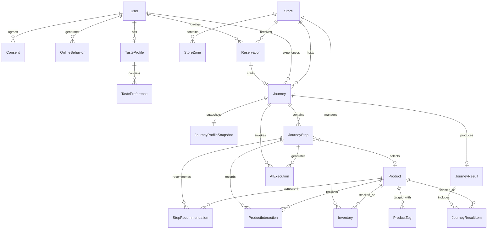

# MCM Journey Passport Database Schema

## 1. 문서 목적

이 문서는 MCM Journey Passport 해커톤 MVP의 데이터베이스 논리 구조를 정의합니다.

다음 사용자 흐름을 안정적으로 저장하고 복원하는 것이 목적입니다.

```text
가상 고객 로그인
→ 개인정보 및 행동 데이터 활용 동의
→ 온라인 취향 데이터 확인
→ 매장 Journey 예약
→ 시작 질문 응답
→ QR 발급 및 체크인
→ AI 시나리오 생성
→ 실제 제품 선택·비교·거절
→ 다음 매장 구역 안내
→ Journey 확장 또는 종료
→ Journey Signature 생성
→ 결과 저장 및 직원용 접객 요약
```

이 문서는 실제 Prisma 구현의 기준 문서로 사용합니다.

---

# 2. 설계 범위

## 2.1 데이터베이스에 저장하는 데이터

- 가상 사용자 계정
- 개인정보 및 행동 데이터 활용 동의
- 온라인 상품 탐색 기록
- 고객의 장기 취향 프로필
- 매장과 매장 구역
- 제품과 스타일 태그
- 매장별 전시 및 재고 정보
- Journey 예약
- QR 체크인 정보
- Journey 진행 상태
- AI가 생성한 단계별 시나리오
- 단계별 추천 제품
- 고객의 제품 선택·비교·거절 기록
- 최종 Journey Signature
- 최종 제품 조합
- 직원용 접객 요약
- AI 호출 성공·실패 기록

## 2.2 MVP에서 저장하지 않는 데이터

- 실제 MCM 회원 개인정보
- 실제 결제 정보
- 실제 배송 및 주문 정보
- 정밀한 매장 내 실시간 위치
- 고객의 실제 얼굴이나 신체 정보
- 실사형 가상 피팅 데이터
- 실제 NFC 하드웨어 로그
- 실제 각인 장비 정보
- 실제 MCM 전체 재고 데이터

## 2.3 기본 설계 원칙

1. 해커톤에서는 실제 개인정보가 아닌 가상 고객 데이터를 사용합니다.
2. 고객이 동의한 경우에만 온라인 행동 데이터를 Journey에 활용합니다.
3. AI는 데이터베이스에 등록된 제품과 매장 구역만 선택할 수 있습니다.
4. 고객의 선택과 거절 기록은 모두 저장합니다.
5. 페이지를 새로고침해도 Journey를 현재 단계부터 복구할 수 있어야 합니다.
6. AI 호출이 실패해도 규칙 기반 기본 시나리오로 Journey가 계속 진행되어야 합니다.
7. 예약, Journey와 결과 데이터는 임의로 삭제하지 않고 상태값으로 관리합니다.
8. 제품과 매장은 삭제보다 비활성화 방식을 사용합니다.
9. 직원에게는 고객의 전체 행동 원본이 아니라 AI가 생성한 접객 요약만 제공합니다.

---

# 3. 전체 엔터티 목록

## 핵심 엔터티

| 엔터티 | 역할 |
|---|---|
| `User` | 가상 고객 및 직원 계정 |
| `Consent` | 개인정보·행동 데이터 활용 동의 이력 |
| `OnlineBehavior` | 고객의 온라인 상품 탐색 행동 |
| `TasteProfile` | 고객의 장기 취향 요약 |
| `TastePreference` | 선호 카테고리·색상·스타일 세부 정보 |
| `Store` | Journey를 운영하는 MCM 매장 |
| `StoreZone` | 가방·의류·신발·액세서리 매장 구역 |
| `Product` | Journey에서 체험할 MCM 제품 |
| `ProductTag` | 제품의 스타일 및 객관적 속성 |
| `Inventory` | 매장별 제품 위치와 체험 가능 여부 |
| `Reservation` | Journey 예약과 시작 질문 |
| `Journey` | 고객의 전체 매장 여정 |
| `JourneyProfileSnapshot` | Journey 시작 시점의 고객 취향 스냅샷 |
| `JourneyStep` | 단계별 시나리오와 선택 상태 |
| `StepRecommendation` | 각 단계에서 제안한 제품 후보 |
| `ProductInteraction` | 제품 조회·비교·선택·거절 이력 |
| `JourneyResult` | 최종 Journey Signature와 스타일 서사 |
| `JourneyResultItem` | 최종 결과에 포함된 제품 |
| `AIExecution` | AI 호출 요청·응답·실패 기록 |

---

# 4. 엔터티 관계도



---

# 5. Enum 정의

## 5.1 UserRole

```text
CUSTOMER
STAFF
```

- `CUSTOMER`: Journey를 예약하고 체험하는 고객
- `STAFF`: 예약 현황과 접객 요약을 확인하는 직원

MVP에서는 별도의 관리자 계정을 구현하지 않습니다.

---

## 5.2 OnlineEventType

```text
VIEW
REPEAT_VIEW
WISHLIST
CART
PURCHASE
STORE_VISIT
JOURNEY_VIEW
```

- `VIEW`: 제품 상세 조회
- `REPEAT_VIEW`: 동일 제품 반복 조회
- `WISHLIST`: 위시리스트 추가
- `CART`: 장바구니 추가
- `PURCHASE`: 과거 구매 기록
- `STORE_VISIT`: 과거 매장 방문
- `JOURNEY_VIEW`: 이전 Journey 결과 조회

---

## 5.3 PreferenceType

```text
CATEGORY
COLOR
STYLE
MATERIAL
FUNCTION
```

- `CATEGORY`: 가방·의류·신발 등 선호
- `COLOR`: 선호 색상
- `STYLE`: 미니멀·클래식·대담함 등 선호
- `MATERIAL`: 선호 소재
- `FUNCTION`: 실용성·수납·다양한 착용 방식 등 선호

---

## 5.4 ProductCategory

```text
BAG
APPAREL
SHOES
ACCESSORY
```

---

## 5.5 ProductTagType

```text
STYLE
FUNCTION
SILHOUETTE
MOOD
```

- `STYLE`: 미니멀, 클래식, 도시적 등
- `FUNCTION`: 수납, 양손 자유, 스트랩 조절 등
- `SILHOUETTE`: 구조적, 부드러운 실루엣 등
- `MOOD`: 대담함, 활동적, 자기표현 등

---

## 5.6 TagSource

```text
MANUAL
AI
RULE
```

- `MANUAL`: 팀 또는 상품 담당자가 직접 등록
- `AI`: AI가 이미지·설명을 분석해 생성
- `RULE`: 상품의 객관적인 속성에서 계산

---

## 5.7 ReservationStatus

```text
RESERVED
CHECKED_IN
COMPLETED
CANCELLED
EXPIRED
```

- `RESERVED`: 예약 완료
- `CHECKED_IN`: QR 체크인 완료
- `COMPLETED`: Journey 종료
- `CANCELLED`: 고객 또는 운영자가 취소
- `EXPIRED`: 예약 시간이 지나 사용 불가

---

## 5.8 JourneyStatus

```text
READY
ACTIVE
FINISHED
CANCELLED
```

- `READY`: 체크인했지만 Journey 시작 전
- `ACTIVE`: Journey 진행 중
- `FINISHED`: 최종 결과 생성 완료
- `CANCELLED`: Journey 중단

---

## 5.9 JourneyStage

```text
INTRO
BAG
APPAREL
SHOES
ACCESSORY
RESULT
```

- `INTRO`: 첫 시나리오
- `BAG`: 중심 가방 선택
- `APPAREL`: 의류 선택
- `SHOES`: 신발 선택
- `ACCESSORY`: 액세서리 선택
- `RESULT`: Journey 종료 및 결과 생성

Journey가 모든 단계를 반드시 순서대로 거쳐야 하는 것은 아닙니다.

예시:

```text
BAG → APPAREL → RESULT
BAG → SHOES → ACCESSORY → RESULT
BAG → APPAREL → ACCESSORY → RESULT
```

---

## 5.10 JourneyStepStatus

```text
GENERATED
IN_PROGRESS
COMPLETED
SKIPPED
```

- `GENERATED`: AI 시나리오와 추천 제품 생성 완료
- `IN_PROGRESS`: 고객이 제품을 비교하는 중
- `COMPLETED`: 제품 선택 완료
- `SKIPPED`: 고객이 해당 단계 없이 Journey 종료 또는 다른 단계로 이동

---

## 5.11 InteractionType

```text
VIEWED
COMPARED
SELECTED
REJECTED
DESELECTED
```

- `VIEWED`: 제품을 확인함
- `COMPARED`: 다른 제품과 비교함
- `SELECTED`: 해당 단계의 제품으로 선택함
- `REJECTED`: 고객이 원하지 않는다고 표시함
- `DESELECTED`: 이전 선택을 취소함

---

## 5.12 RecommendationType

```text
MATCH
COMPARE
CHALLENGE
```

- `MATCH`: 기존 취향과 잘 맞는 제품
- `COMPARE`: 선택을 비교할 수 있는 대안 제품
- `CHALLENGE`: 기존 취향을 확장하는 예상 밖의 제품

각 Journey 단계에서는 가능하면 세 유형을 균형 있게 제공합니다.

---

## 5.13 AIPurpose

```text
TASTE_ANALYSIS
JOURNEY_STEP
JOURNEY_RESULT
STAFF_SUMMARY
```

---

## 5.14 AIExecutionStatus

```text
SUCCESS
FALLBACK
FAILED
```

- `SUCCESS`: AI가 정상적인 구조화 결과를 반환함
- `FALLBACK`: AI 호출 또는 검증 실패 후 기본 결과를 사용함
- `FAILED`: 결과 생성에 실패했고 대체 결과도 생성하지 못함

Journey 진행 중에는 `FAILED` 상태가 발생하더라도 서비스가 중단되지 않도록 기본 시나리오를 사용해야 합니다.

---

# 6. 테이블 상세 설계

## 6.1 User

가상 고객과 직원 정보를 저장합니다.

| 필드 | 타입 | 필수 | 설명 |
|---|---|---:|---|
| `id` | String | O | 사용자 ID |
| `email` | String | O | 로그인용 데모 이메일 |
| `name` | String | O | 사용자 이름 |
| `role` | UserRole | O | 고객 또는 직원 |
| `profileType` | String | X | 데모 고객 유형 |
| `avatarUrl` | String | X | 프로필 이미지 |
| `isActive` | Boolean | O | 계정 활성 여부 |
| `createdAt` | DateTime | O | 생성 일시 |
| `updatedAt` | DateTime | O | 수정 일시 |

### 제약조건

- `email`은 고유해야 합니다.
- MVP 로그인은 비밀번호가 아니라 가상 사용자 선택 방식으로 구현합니다.
- 실제 개인정보는 저장하지 않습니다.
- 삭제 대신 `isActive = false`로 처리합니다.

### 인덱스

```text
UNIQUE(email)
INDEX(role, isActive)
```

---

## 6.2 Consent

사용자의 동의 이력을 저장합니다.

| 필드 | 타입 | 필수 | 설명 |
|---|---|---:|---|
| `id` | String | O | 동의 기록 ID |
| `userId` | String | O | 사용자 ID |
| `consentVersion` | String | O | 동의 문서 버전 |
| `behaviorDataAllowed` | Boolean | O | 온라인 행동 데이터 활용 동의 |
| `journeyDataAllowed` | Boolean | O | Journey 기록 활용 동의 |
| `marketingAllowed` | Boolean | O | 마케팅 활용 동의 |
| `agreedAt` | DateTime | O | 동의 일시 |
| `withdrawnAt` | DateTime | X | 동의 철회 일시 |

### 관계

```text
Consent.userId → User.id
```

### 운영 규칙

- 동의 기록은 덮어쓰지 않고 새로운 행으로 추가합니다.
- 현재 유효한 동의는 `withdrawnAt`이 없고 가장 최근인 기록입니다.
- `behaviorDataAllowed = false`인 경우 온라인 행동 원본을 Journey AI 입력으로 사용하지 않습니다.
- `journeyDataAllowed = false`인 경우 Journey 예약을 진행할 수 없도록 합니다.
- `marketingAllowed`는 MVP 핵심 기능에 사용하지 않습니다.

### 인덱스

```text
INDEX(userId, agreedAt)
```

---

## 6.3 OnlineBehavior

고객의 온라인 상품 탐색 행동을 저장합니다.

| 필드 | 타입 | 필수 | 설명 |
|---|---|---:|---|
| `id` | String | O | 행동 ID |
| `userId` | String | O | 사용자 ID |
| `productId` | String | X | 관련 제품 ID |
| `eventType` | OnlineEventType | O | 행동 유형 |
| `selectedColor` | String | X | 확인한 색상 |
| `selectedOption` | String | X | 선택한 옵션 |
| `durationSeconds` | Int | X | 페이지 체류 시간 |
| `metadataJson` | String | X | 추가 시연 데이터 |
| `occurredAt` | DateTime | O | 행동 발생 시각 |

### 관계

```text
OnlineBehavior.userId → User.id
OnlineBehavior.productId → Product.id
```

### 운영 규칙

- 행동 데이터는 실제 추적이 아니라 `seed.ts`에서 생성한 가상 데이터입니다.
- `productId`가 없는 매장 방문 등의 행동도 저장할 수 있습니다.
- `durationSeconds` 하나만으로 선호도를 결정하지 않습니다.
- 반복 조회, 위시리스트, 비교와 옵션 선택을 종합해 취향을 계산합니다.

### 인덱스

```text
INDEX(userId, occurredAt)
INDEX(userId, eventType)
INDEX(productId, eventType)
```

---

## 6.4 TasteProfile

온라인 행동을 분석해 생성한 고객의 장기 취향 요약입니다.

| 필드 | 타입 | 필수 | 설명 |
|---|---|---:|---|
| `id` | String | O | 취향 프로필 ID |
| `userId` | String | O | 사용자 ID |
| `summary` | String | O | 장기 취향 자연어 요약 |
| `practicalityScore` | Int | O | 실용성 선호 점수 |
| `expressionScore` | Int | O | 자기표현 선호 점수 |
| `noveltyScore` | Int | O | 새로운 스타일 수용 점수 |
| `confidenceScore` | Int | O | 프로필 신뢰도 |
| `calculatedAt` | DateTime | O | 계산 시각 |
| `updatedAt` | DateTime | O | 수정 시각 |

### 관계

```text
TasteProfile.userId → User.id
```

### 제약조건

- 사용자당 하나의 최신 TasteProfile만 보유합니다.
- 점수 범위는 `0~100`으로 제한합니다.
- 온라인 행동이 부족하면 `confidenceScore`를 낮게 설정합니다.

### 인덱스

```text
UNIQUE(userId)
```

---

## 6.5 TastePreference

TasteProfile에 포함된 선호 항목을 세부적으로 저장합니다.

| 필드 | 타입 | 필수 | 설명 |
|---|---|---:|---|
| `id` | String | O | 선호 항목 ID |
| `tasteProfileId` | String | O | 취향 프로필 ID |
| `type` | PreferenceType | O | 선호 유형 |
| `value` | String | O | 선호 값 |
| `score` | Int | O | 선호 강도 |
| `source` | String | O | 행동 데이터 또는 수동 입력 |
| `createdAt` | DateTime | O | 생성 일시 |

### 예시

```text
CATEGORY / BAG / 92
COLOR / BLACK / 88
STYLE / URBAN / 81
FUNCTION / STORAGE / 77
STYLE / BOLD / 42
```

### 관계

```text
TastePreference.tasteProfileId → TasteProfile.id
```

### 제약조건

```text
UNIQUE(tasteProfileId, type, value)
```

### 인덱스

```text
INDEX(tasteProfileId, type)
```

---

## 6.6 Store

Journey를 운영하는 매장 정보를 저장합니다.

| 필드 | 타입 | 필수 | 설명 |
|---|---|---:|---|
| `id` | String | O | 매장 ID |
| `code` | String | O | 매장 식별 코드 |
| `name` | String | O | 매장명 |
| `location` | String | O | 매장 위치 |
| `description` | String | X | 매장 설명 |
| `imageUrl` | String | X | 매장 이미지 |
| `isJourneyEnabled` | Boolean | O | Journey 운영 여부 |
| `isActive` | Boolean | O | 활성 여부 |
| `createdAt` | DateTime | O | 생성 일시 |
| `updatedAt` | DateTime | O | 수정 일시 |

### 제약조건

```text
UNIQUE(code)
```

MVP에서는 시연용 매장 한 곳만 등록합니다.

---

## 6.7 StoreZone

매장의 제품 구역과 브랜드 헤리티지 정보를 저장합니다.

| 필드 | 타입 | 필수 | 설명 |
|---|---|---:|---|
| `id` | String | O | 매장 구역 ID |
| `storeId` | String | O | 매장 ID |
| `code` | String | O | 구역 코드 |
| `name` | String | O | 구역 이름 |
| `category` | ProductCategory | O | 대표 제품군 |
| `floor` | String | X | 층 또는 위치 |
| `directionText` | String | O | 고객에게 보여줄 이동 안내 |
| `heritageTitle` | String | X | 브랜드 이야기 제목 |
| `heritageStory` | String | X | 브랜드 헤리티지 설명 |
| `displayOrder` | Int | O | 기본 표시 순서 |
| `isActive` | Boolean | O | 구역 활성 여부 |

### 관계

```text
StoreZone.storeId → Store.id
```

### 제약조건

```text
UNIQUE(storeId, code)
```

### MVP 구역 예시

```text
ZONE_BAG
ZONE_APPAREL
ZONE_SHOES
ZONE_ACCESSORY
```

---

## 6.8 Product

Journey에서 체험할 제품의 기본 정보를 저장합니다.

| 필드 | 타입 | 필수 | 설명 |
|---|---|---:|---|
| `id` | String | O | 제품 ID |
| `sku` | String | O | 제품 식별 코드 |
| `name` | String | O | 제품명 |
| `category` | ProductCategory | O | 제품 카테고리 |
| `color` | String | O | 대표 색상 |
| `material` | String | X | 소재 |
| `priceKrw` | Int | O | 원 단위 가격 |
| `size` | String | X | 제품 크기 |
| `capacity` | String | X | 수납 관련 설명 |
| `wearMethod` | String | X | 착용 방식 |
| `description` | String | O | 상품 설명 |
| `imageUrl` | String | O | 상품 이미지 |
| `personaLayerUrl` | String | X | 캐릭터 적용 이미지 |
| `sceneBackgroundKey` | String | X | 배경 장면 연결 키 |
| `isActive` | Boolean | O | 제품 활성 여부 |
| `createdAt` | DateTime | O | 생성 일시 |
| `updatedAt` | DateTime | O | 수정 일시 |

### 제약조건

```text
UNIQUE(sku)
```

### 운영 규칙

- 가격은 부동소수점이 아닌 원 단위 정수로 저장합니다.
- 제품이 Journey에서 제외되더라도 기존 기록 보존을 위해 삭제하지 않습니다.
- `isActive = false`인 제품은 새로운 추천 후보에 포함하지 않습니다.

---

## 6.9 ProductTag

제품의 객관적 속성과 스타일 태그를 저장합니다.

| 필드 | 타입 | 필수 | 설명 |
|---|---|---:|---|
| `id` | String | O | 태그 ID |
| `productId` | String | O | 제품 ID |
| `type` | ProductTagType | O | 태그 유형 |
| `name` | String | O | 태그명 |
| `score` | Int | O | 태그 강도 |
| `source` | TagSource | O | 태그 생성 방식 |
| `verified` | Boolean | O | 담당자 검토 여부 |
| `createdAt` | DateTime | O | 생성 일시 |
| `updatedAt` | DateTime | O | 수정 일시 |

### 태그 예시

```text
STYLE / MINIMAL
STYLE / CLASSIC
STYLE / URBAN
MOOD / BOLD
MOOD / ACTIVE
MOOD / SELF_EXPRESSION
SILHOUETTE / SOFT
SILHOUETTE / STRUCTURED
FUNCTION / HIGH_CAPACITY
FUNCTION / HANDS_FREE
FUNCTION / ADJUSTABLE_STRAP
```

### 관계

```text
ProductTag.productId → Product.id
```

### 제약조건

```text
UNIQUE(productId, type, name)
```

### 운영 규칙

- 해커톤 MVP 제품의 태그는 팀이 직접 검토합니다.
- `source = AI`이고 `verified = false`인 태그는 실제 추천 점수에 사용할 수 없도록 설정할 수 있습니다.

---

## 6.10 Inventory

매장별 제품 위치, 수량과 체험 가능 여부를 저장합니다.

| 필드 | 타입 | 필수 | 설명 |
|---|---|---:|---|
| `id` | String | O | 재고 ID |
| `storeId` | String | O | 매장 ID |
| `zoneId` | String | O | 매장 구역 ID |
| `productId` | String | O | 제품 ID |
| `quantity` | Int | O | 시연용 재고 수량 |
| `isDisplayAvailable` | Boolean | O | 매장 체험 가능 여부 |
| `updatedAt` | DateTime | O | 수정 일시 |

### 관계

```text
Inventory.storeId → Store.id
Inventory.zoneId → StoreZone.id
Inventory.productId → Product.id
```

### 제약조건

```text
UNIQUE(storeId, productId)
```

### 추천 가능 조건

제품은 다음 조건을 모두 만족해야 AI 추천 후보에 포함됩니다.

```text
Product.isActive = true
Store.isActive = true
StoreZone.isActive = true
Inventory.quantity > 0
Inventory.isDisplayAvailable = true
```

### 추가 검증

- `zoneId`가 속한 `storeId`와 Inventory의 `storeId`가 같아야 합니다.
- 제품 카테고리와 구역의 대표 카테고리는 기본적으로 일치해야 합니다.

---

## 6.11 Reservation

Journey 예약, 시작 질문과 QR 정보를 저장합니다.

| 필드 | 타입 | 필수 | 설명 |
|---|---|---:|---|
| `id` | String | O | 예약 ID |
| `userId` | String | O | 고객 ID |
| `storeId` | String | O | 예약 매장 ID |
| `reservedAt` | DateTime | O | 예약 일시 |
| `startQuestionCode` | String | O | 시작 질문 코드 |
| `startAnswerCode` | String | O | 고객 답변 코드 |
| `startAnswerLabel` | String | O | 고객에게 표시한 답변 |
| `qrToken` | String | O | QR에 포함되는 일회용 토큰 |
| `status` | ReservationStatus | O | 예약 상태 |
| `checkedInAt` | DateTime | X | 체크인 시간 |
| `completedAt` | DateTime | X | 체험 완료 시간 |
| `cancelledAt` | DateTime | X | 예약 취소 시간 |
| `createdAt` | DateTime | O | 생성 일시 |
| `updatedAt` | DateTime | O | 수정 일시 |

### 관계

```text
Reservation.userId → User.id
Reservation.storeId → Store.id
```

### 제약조건

```text
UNIQUE(qrToken)
```

### 운영 규칙

- 고객은 유효한 동의 기록이 있어야 예약할 수 있습니다.
- QR 토큰은 예약 ID를 직접 노출하지 않는 임의 문자열로 생성합니다.
- 체크인 성공 시 `RESERVED → CHECKED_IN`으로 변경합니다.
- 동일 QR로 Journey를 두 번 생성할 수 없습니다.
- 체크인 후 QR을 다시 사용하면 기존 Journey로 이동합니다.
- MVP에서는 시작 질문을 한 개만 사용하므로 Reservation에 직접 저장합니다.
- 질문이 여러 개로 확장되면 별도의 `ReservationAnswer` 테이블로 분리할 수 있습니다.

### 인덱스

```text
INDEX(userId, reservedAt)
INDEX(storeId, reservedAt, status)
UNIQUE(qrToken)
```

---

## 6.12 Journey

고객의 매장 Journey 전체 진행 상태를 저장합니다.

| 필드 | 타입 | 필수 | 설명 |
|---|---|---:|---|
| `id` | String | O | Journey ID |
| `userId` | String | O | 고객 ID |
| `reservationId` | String | O | 예약 ID |
| `storeId` | String | O | 매장 ID |
| `status` | JourneyStatus | O | Journey 상태 |
| `currentStage` | JourneyStage | O | 현재 단계 |
| `currentStepNumber` | Int | O | 현재 단계 번호 |
| `startedAt` | DateTime | X | Journey 시작 시간 |
| `finishedAt` | DateTime | X | Journey 종료 시간 |
| `cancelledAt` | DateTime | X | 중단 시간 |
| `createdAt` | DateTime | O | 생성 일시 |
| `updatedAt` | DateTime | O | 수정 일시 |

### 관계

```text
Journey.userId → User.id
Journey.reservationId → Reservation.id
Journey.storeId → Store.id
```

### 제약조건

```text
UNIQUE(reservationId)
```

MVP에서는 예약 한 건당 Journey 한 건만 생성합니다.

### 운영 규칙

- 체크인 성공 시 `READY` 상태의 Journey를 생성합니다.
- 첫 시나리오를 시작하면 `READY → ACTIVE`로 변경합니다.
- 최종 결과 생성이 완료되면 `ACTIVE → FINISHED`로 변경합니다.
- `FINISHED` 상태에서는 새로운 제품 선택을 저장할 수 없습니다.
- 페이지 새로고침 시 `currentStage`와 `currentStepNumber`를 기준으로 진행 화면을 복구합니다.

### 인덱스

```text
INDEX(userId, status)
INDEX(storeId, status, createdAt)
UNIQUE(reservationId)
```

---

## 6.13 JourneyProfileSnapshot

Journey 시작 시점의 고객 취향과 AI 입력 정보를 고정해서 저장합니다.

| 필드 | 타입 | 필수 | 설명 |
|---|---|---:|---|
| `id` | String | O | 스냅샷 ID |
| `journeyId` | String | O | Journey ID |
| `longTermTasteSummary` | String | O | 장기 취향 요약 |
| `todayIntentSummary` | String | O | 오늘의 여정 방향 |
| `practicalityScore` | Int | O | 시작 시점 실용성 점수 |
| `expressionScore` | Int | O | 시작 시점 자기표현 점수 |
| `noveltyScore` | Int | O | 새로운 시도 점수 |
| `preferencesJson` | String | O | 선호 카테고리·색상·태그 |
| `behaviorSummaryJson` | String | X | 활용한 행동 데이터 요약 |
| `createdAt` | DateTime | O | 생성 일시 |

### 관계

```text
JourneyProfileSnapshot.journeyId → Journey.id
```

### 제약조건

```text
UNIQUE(journeyId)
```

### 필요한 이유

고객의 TasteProfile이 나중에 변경되더라도 이미 완료된 Journey의 추천 근거를 재현할 수 있어야 합니다.

AI에는 실시간 `TasteProfile`이 아니라 Journey 시작 시 생성한 이 스냅샷을 전달합니다.

---

## 6.14 JourneyStep

Journey의 각 시나리오와 선택 단계를 저장합니다.

| 필드 | 타입 | 필수 | 설명 |
|---|---|---:|---|
| `id` | String | O | 단계 ID |
| `journeyId` | String | O | Journey ID |
| `stepNumber` | Int | O | 단계 순서 |
| `stage` | JourneyStage | O | 단계 유형 |
| `status` | JourneyStepStatus | O | 단계 진행 상태 |
| `scenarioTitle` | String | O | 시나리오 제목 |
| `scenarioText` | String | O | 시나리오 본문 |
| `zoneId` | String | O | 안내한 매장 구역 |
| `heritageTitle` | String | X | 표시할 브랜드 이야기 제목 |
| `heritageText` | String | X | 표시할 브랜드 이야기 |
| `selectedProductId` | String | X | 최종 선택 제품 |
| `canFinishJourney` | Boolean | O | 이 단계 후 종료 가능 여부 |
| `usedFallback` | Boolean | O | AI 기본 응답 사용 여부 |
| `createdAt` | DateTime | O | 생성 일시 |
| `completedAt` | DateTime | X | 단계 완료 시간 |

### 관계

```text
JourneyStep.journeyId → Journey.id
JourneyStep.zoneId → StoreZone.id
JourneyStep.selectedProductId → Product.id
```

### 제약조건

```text
UNIQUE(journeyId, stepNumber)
```

### 운영 규칙

- 단계당 최종 선택 제품은 최대 한 개입니다.
- 제품을 변경하면 기존 제품의 상호작용을 `DESELECTED`로 기록하고 `selectedProductId`를 새 제품으로 변경합니다.
- 추천 후보는 별도의 `StepRecommendation` 테이블에 저장합니다.
- `selectedProductId`는 해당 단계의 추천 후보이거나, 매장에 실제 전시 중인 같은 카테고리 제품이어야 합니다.
- `zoneId`는 현재 Journey의 매장에 속해야 합니다.
- AI가 실패하면 `usedFallback = true`로 저장합니다.

### 인덱스

```text
INDEX(journeyId, stepNumber)
INDEX(journeyId, status)
```

---

## 6.15 StepRecommendation

각 Journey 단계에서 고객에게 제안한 제품 후보를 저장합니다.

| 필드 | 타입 | 필수 | 설명 |
|---|---|---:|---|
| `id` | String | O | 추천 ID |
| `journeyStepId` | String | O | Journey 단계 ID |
| `productId` | String | O | 추천 제품 ID |
| `type` | RecommendationType | O | 추천 유형 |
| `rank` | Int | O | 표시 순위 |
| `ruleScore` | Int | O | 규칙 기반 후보 점수 |
| `reason` | String | O | 고객에게 표시할 추천 이유 |
| `isAiSelected` | Boolean | O | AI가 최종 후보로 선택했는지 |
| `createdAt` | DateTime | O | 생성 일시 |

### 관계

```text
StepRecommendation.journeyStepId → JourneyStep.id
StepRecommendation.productId → Product.id
```

### 제약조건

```text
UNIQUE(journeyStepId, productId)
UNIQUE(journeyStepId, rank)
```

### 운영 규칙

- 백엔드가 재고와 카테고리 조건으로 후보를 먼저 계산합니다.
- AI는 백엔드가 제공한 제품 ID 중에서만 최종 추천 제품을 선택합니다.
- MVP에서는 단계별로 세 개의 후보를 제공하는 것을 기본으로 합니다.
- 가능하면 `MATCH`, `COMPARE`, `CHALLENGE`가 각각 하나씩 포함되도록 합니다.
- 후보가 부족하면 동일 유형을 중복할 수 있습니다.

---

## 6.16 ProductInteraction

고객이 제품을 확인하고 선택하는 모든 행동을 시간순으로 저장합니다.

| 필드 | 타입 | 필수 | 설명 |
|---|---|---:|---|
| `id` | String | O | 상호작용 ID |
| `journeyId` | String | O | Journey ID |
| `journeyStepId` | String | O | Journey 단계 ID |
| `productId` | String | O | 제품 ID |
| `type` | InteractionType | O | 행동 유형 |
| `sequence` | Int | O | Journey 전체 행동 순서 |
| `createdAt` | DateTime | O | 행동 발생 시각 |

### 관계

```text
ProductInteraction.journeyId → Journey.id
ProductInteraction.journeyStepId → JourneyStep.id
ProductInteraction.productId → Product.id
```

### 운영 규칙

- 같은 제품에 대해 여러 상호작용을 저장할 수 있습니다.
- 고객이 선택을 변경한 이력도 삭제하지 않습니다.
- 최종 선택 여부는 `JourneyStep.selectedProductId`를 기준으로 판단합니다.
- AI의 다음 단계 입력에는 최근까지의 `SELECTED`, `REJECTED`, `DESELECTED` 기록을 전달합니다.
- 이미 거절한 제품은 기본적으로 다음 추천 후보에서 제외합니다.

### 제약조건

```text
UNIQUE(journeyId, sequence)
```

### 인덱스

```text
INDEX(journeyId, createdAt)
INDEX(journeyStepId, type)
INDEX(productId, type)
```

---

## 6.17 JourneyResult

Journey 종료 후 생성된 최종 결과를 저장합니다.

| 필드 | 타입 | 필수 | 설명 |
|---|---|---:|---|
| `id` | String | O | 결과 ID |
| `journeyId` | String | O | Journey ID |
| `signatureName` | String | O | Journey Signature 이름 |
| `signatureStory` | String | O | 선택을 연결한 스타일 서사 |
| `finalLookSummary` | String | O | 최종 MCM 룩 설명 |
| `staffSummary` | String | O | 직원용 접객 요약 |
| `personaBaseKey` | String | X | 기본 캐릭터 식별자 |
| `sceneKey` | String | X | 최종 Journey Scene |
| `shareToken` | String | O | 공유 페이지 접근 토큰 |
| `usedFallback` | Boolean | O | AI 기본 결과 사용 여부 |
| `createdAt` | DateTime | O | 생성 일시 |
| `updatedAt` | DateTime | O | 수정 일시 |

### 관계

```text
JourneyResult.journeyId → Journey.id
```

### 제약조건

```text
UNIQUE(journeyId)
UNIQUE(shareToken)
```

### 운영 규칙

- Journey당 최종 결과는 하나만 생성합니다.
- 동일 Journey에 결과 생성 API를 반복 호출해도 기존 결과를 반환합니다.
- `staffSummary`에는 고객의 전체 온라인 행동 원본을 포함하지 않습니다.
- 직원에게 필요한 관심 제품, 오늘의 방향, 반응한 제품과 설명 포인트만 제공합니다.
- 공유 페이지에서는 사용자 이름, 이메일과 행동 기록을 노출하지 않습니다.

---

## 6.18 JourneyResultItem

최종 Journey 결과에 포함된 제품과 추천 이유를 저장합니다.

| 필드 | 타입 | 필수 | 설명 |
|---|---|---:|---|
| `id` | String | O | 결과 제품 ID |
| `journeyResultId` | String | O | Journey 결과 ID |
| `productId` | String | O | 제품 ID |
| `category` | ProductCategory | O | 제품 카테고리 |
| `selectionOrder` | Int | O | 선택 순서 |
| `recommendationReason` | String | O | 최종 추천 이유 |
| `personaLayerUrl` | String | X | 결과 캐릭터 레이어 |
| `createdAt` | DateTime | O | 생성 일시 |

### 관계

```text
JourneyResultItem.journeyResultId → JourneyResult.id
JourneyResultItem.productId → Product.id
```

### 제약조건

```text
UNIQUE(journeyResultId, productId)
UNIQUE(journeyResultId, selectionOrder)
```

### 필요한 이유

최종 결과가 생성된 이후 Product 정보가 수정되더라도, 고객이 당시 선택한 제품 순서와 추천 이유를 유지할 수 있습니다.

---

## 6.19 AIExecution

AI 호출 내용과 성공·실패 상태를 기록합니다.

| 필드 | 타입 | 필수 | 설명 |
|---|---|---:|---|
| `id` | String | O | AI 실행 ID |
| `journeyId` | String | O | Journey ID |
| `journeyStepId` | String | X | 관련 Journey 단계 |
| `purpose` | AIPurpose | O | AI 호출 목적 |
| `status` | AIExecutionStatus | O | 실행 결과 |
| `promptVersion` | String | O | 프롬프트 버전 |
| `modelName` | String | X | 사용 모델 |
| `requestJson` | String | O | AI에 전달한 구조화 입력 |
| `responseJson` | String | X | AI의 구조화 응답 |
| `validated` | Boolean | O | 서버 검증 통과 여부 |
| `latencyMs` | Int | X | 응답 시간 |
| `errorMessage` | String | X | 오류 메시지 |
| `createdAt` | DateTime | O | 실행 일시 |

### 관계

```text
AIExecution.journeyId → Journey.id
AIExecution.journeyStepId → JourneyStep.id
```

### 운영 규칙

- API 키는 저장하지 않습니다.
- AI에 전달한 입력과 응답은 디버깅 가능한 JSON 문자열로 저장합니다.
- 서버가 존재하지 않는 제품 ID나 구역 ID를 발견하면 `validated = false`로 저장합니다.
- 검증 실패 시 해당 결과를 사용하지 않고 기본 시나리오를 생성합니다.
- `responseJson`은 고객에게 직접 노출하지 않습니다.

### 인덱스

```text
INDEX(journeyId, purpose, createdAt)
INDEX(status, createdAt)
```

---

# 7. 핵심 관계 및 Cardinality

## 사용자와 취향

```text
User 1 : N Consent
User 1 : N OnlineBehavior
User 1 : 1 TasteProfile
TasteProfile 1 : N TastePreference
```

## 매장과 제품

```text
Store 1 : N StoreZone
Store 1 : N Inventory
Product 1 : N Inventory
Product 1 : N ProductTag
```

## 예약과 Journey

```text
User 1 : N Reservation
Store 1 : N Reservation
Reservation 1 : 0..1 Journey
Journey 1 : 1 JourneyProfileSnapshot
Journey 1 : N JourneyStep
```

## 단계와 제품

```text
JourneyStep 1 : N StepRecommendation
JourneyStep 1 : N ProductInteraction
JourneyStep N : 0..1 selected Product
```

## 최종 결과

```text
Journey 1 : 0..1 JourneyResult
JourneyResult 1 : N JourneyResultItem
```

---

# 8. Journey 상태 전이

## 8.1 예약 상태

```text
RESERVED
   ├─ QR 체크인 성공 → CHECKED_IN
   ├─ 고객 취소 → CANCELLED
   └─ 예약 시간 만료 → EXPIRED

CHECKED_IN
   ├─ Journey 완료 → COMPLETED
   └─ 운영 중단 → CANCELLED
```

## 8.2 Journey 상태

```text
READY
   └─ 첫 시나리오 시작 → ACTIVE

ACTIVE
   ├─ 결과 생성 완료 → FINISHED
   └─ 고객 또는 운영자 중단 → CANCELLED
```

## 8.3 Journey 단계

기본적인 최초 단계는 다음과 같습니다.

```text
INTRO → BAG
```

가방 선택 후에는 AI가 다음 단계 중 하나를 선택할 수 있습니다.

```text
APPAREL
SHOES
ACCESSORY
```

최소 Journey 완료 조건은 다음과 같이 정의합니다.

```text
가방 1개 선택
+ 의류·신발·액세서리 중 최소 1개 선택
```

최소 조건을 만족하면 고객은 다음 중 하나를 선택할 수 있습니다.

```text
스타일 확장
Journey 종료
```

Journey 종료를 선택하면 다음 단계로 이동합니다.

```text
RESULT
```

---

# 9. 핵심 비즈니스 규칙

## 9.1 동의 규칙

1. 유효한 Journey 데이터 활용 동의가 없으면 예약할 수 없습니다.
2. 온라인 행동 데이터 활용에 동의하지 않은 고객도 Journey를 이용할 수 있습니다.
3. 온라인 행동 데이터 미동의 시 시작 질문과 매장 선택만으로 추천합니다.
4. 직원에게 원본 행동 기록을 제공하지 않습니다.

## 9.2 예약 및 QR 규칙

1. QR 토큰은 고유해야 합니다.
2. QR은 해당 예약과 매장에만 사용할 수 있습니다.
3. 체크인된 예약으로 두 번째 Journey를 만들 수 없습니다.
4. QR 인식 실패 시 예약 코드를 직접 입력할 수 있습니다.
5. 예약 시간이 지난 경우 시연 설정에 따라 체크인을 허용하거나 `EXPIRED` 처리합니다.

## 9.3 제품 추천 규칙

1. 현재 매장에 등록된 제품만 추천합니다.
2. 수량이 0인 제품은 추천하지 않습니다.
3. 체험 불가능한 제품은 추천하지 않습니다.
4. 비활성화된 제품은 추천하지 않습니다.
5. 현재 단계에 맞는 카테고리 제품만 추천합니다.
6. 고객이 이미 선택한 제품은 다시 추천하지 않습니다.
7. 고객이 거절한 제품은 기본적으로 다시 추천하지 않습니다.
8. AI는 서버가 제공한 제품 ID 외의 상품을 생성할 수 없습니다.
9. 추천된 제품의 매장 구역은 Inventory와 StoreZone에서 조회합니다.

## 9.4 선택 기록 규칙

1. 모든 조회·비교·선택·거절 행동은 시간순으로 저장합니다.
2. 단계별 최종 선택 제품은 하나만 유지합니다.
3. 선택을 취소해도 기존 기록을 삭제하지 않습니다.
4. 선택 변경 시 기존 제품에 `DESELECTED`, 새 제품에 `SELECTED` 기록을 추가합니다.

## 9.5 Journey 결과 규칙

1. Journey당 결과는 하나만 생성합니다.
2. 가방과 추가 제품 하나 이상이 선택되어야 종료할 수 있습니다.
3. 결과에는 최종 선택 제품만 포함합니다.
4. 추천 이유는 각 제품별로 저장합니다.
5. 공유 페이지에는 개인정보를 노출하지 않습니다.
6. Journey 종료 후 제품 선택 기록은 변경하지 않습니다.

## 9.6 AI 실패 규칙

1. AI 응답은 정해진 JSON 구조로 검증합니다.
2. 존재하지 않는 제품 ID가 있으면 결과를 폐기합니다.
3. 존재하지 않는 구역 ID가 있으면 결과를 폐기합니다.
4. AI 호출 실패 시 규칙 기반 기본 시나리오를 사용합니다.
5. AI 재시도는 한 번만 수행합니다.
6. AI 실패 때문에 전체 Journey가 중단되어서는 안 됩니다.

---

# 10. 삭제 및 보존 정책

## 10.1 Soft Delete 대상

다음 데이터는 물리적으로 삭제하지 않고 활성 상태를 변경합니다.

- `User`
- `Store`
- `StoreZone`
- `Product`

```text
isActive = false
```

## 10.2 보존 대상

다음 데이터는 Journey 재현과 시연 기록을 위해 유지합니다.

- `Reservation`
- `Journey`
- `JourneyProfileSnapshot`
- `JourneyStep`
- `StepRecommendation`
- `ProductInteraction`
- `JourneyResult`
- `JourneyResultItem`
- `AIExecution`

## 10.3 개발용 초기화

해커톤 시연을 위해 개발 환경에서만 사용할 초기화 기능을 제공합니다.

```text
POST /api/dev/reset-demo
```

초기화 시 다음 작업을 수행합니다.

1. 예약·Journey·결과 데이터 삭제
2. 가상 사용자의 동의 상태 초기화
3. 온라인 행동과 TasteProfile을 기본 시드 상태로 복원
4. 제품 재고와 활성 상태 복원
5. 고정 시연용 계정 재생성

운영 환경에서는 이 API를 비활성화합니다.

---

# 11. 주요 인덱스 요약

```text
User
- UNIQUE(email)

Consent
- INDEX(userId, agreedAt)

OnlineBehavior
- INDEX(userId, occurredAt)
- INDEX(userId, eventType)
- INDEX(productId, eventType)

TasteProfile
- UNIQUE(userId)

TastePreference
- UNIQUE(tasteProfileId, type, value)

Store
- UNIQUE(code)

StoreZone
- UNIQUE(storeId, code)

Product
- UNIQUE(sku)

ProductTag
- UNIQUE(productId, type, name)

Inventory
- UNIQUE(storeId, productId)

Reservation
- UNIQUE(qrToken)
- INDEX(userId, reservedAt)
- INDEX(storeId, reservedAt, status)

Journey
- UNIQUE(reservationId)
- INDEX(userId, status)
- INDEX(storeId, status, createdAt)

JourneyProfileSnapshot
- UNIQUE(journeyId)

JourneyStep
- UNIQUE(journeyId, stepNumber)

StepRecommendation
- UNIQUE(journeyStepId, productId)
- UNIQUE(journeyStepId, rank)

ProductInteraction
- UNIQUE(journeyId, sequence)
- INDEX(journeyId, createdAt)

JourneyResult
- UNIQUE(journeyId)
- UNIQUE(shareToken)

JourneyResultItem
- UNIQUE(journeyResultId, productId)
- UNIQUE(journeyResultId, selectionOrder)

AIExecution
- INDEX(journeyId, purpose, createdAt)
- INDEX(status, createdAt)
```

---

# 12. MVP 시드 데이터 구성

## 12.1 사용자

최소 두 명의 서로 다른 가상 고객을 생성합니다.

### 고객 A: Stable Explorer

```text
선호 제품: 백팩
선호 색상: 검정, 브라운
선호 태그: 실용적, 클래식, 도시적
실용성 점수: 높음
자기표현 점수: 중간
새로운 스타일 수용도: 낮음
```

### 고객 B: Bold Mover

```text
선호 제품: 미니백, 액세서리
선호 색상: 밝은 색상, 대비가 강한 색상
선호 태그: 대담함, 자기표현, 구조적 실루엣
실용성 점수: 중간
자기표현 점수: 높음
새로운 스타일 수용도: 높음
```

두 고객이 같은 가방을 선택하더라도 서로 다른 다음 제품과 시나리오가 생성되는 모습을 시연합니다.

## 12.2 매장

```text
매장 1개
- MCM Journey Flagship Demo Store
```

## 12.3 매장 구역

```text
가방 구역 1개
의류 구역 1개
신발 구역 1개
액세서리 구역 1개
```

## 12.4 제품

```text
가방 3~4개
의류 3~4개
신발 또는 액세서리 3~4개
```

전체 제품 수는 9~12개를 권장합니다.

## 12.5 제품별 필수 태그

각 제품에는 최소 다음 정보가 있어야 합니다.

```text
카테고리
대표 색상
스타일 태그 2개 이상
기능 태그 1개 이상
매장 구역
재고 수량
체험 가능 여부
추천용 이미지
캐릭터 레이어 이미지
```

## 12.6 온라인 행동 데이터

고객별로 다음 행동을 미리 생성합니다.

```text
반복 조회
위시리스트
장바구니
색상 옵션 선택
제품 비교
과거 Journey 기록
```

---

# 13. Prisma 구현 시 지켜야 할 규칙

1. 모든 기본키는 `String` 타입 UUID 또는 CUID를 사용합니다.
2. 생성·수정 일시는 `createdAt`, `updatedAt`으로 통일합니다.
3. 가격은 `Int`형 원 단위로 저장합니다.
4. JSON 데이터는 SQLite 호환성을 고려해 문자열로 저장하고 애플리케이션에서 검증합니다.
5. enum 이름과 값은 이 문서의 명칭을 사용합니다.
6. 관계 필드와 외래키 필드를 모두 명시합니다.
7. `onDelete: Cascade`는 개발용 하위 데이터에만 제한적으로 사용합니다.
8. Product, Store, User는 Cascade 삭제하지 않습니다.
9. `Reservation.reservationId`와 `JourneyResult.journeyId` 등 1:1 관계에는 unique 제약조건을 적용합니다.
10. 시드 데이터 생성 후 모든 관계가 정상 연결되는지 테스트합니다.

---

# 14. Codex 구현 완료 조건

Codex가 실제 `schema.prisma`를 구현한 후 다음 조건을 만족해야 합니다.

## 스키마

- 모든 enum이 생성되어 있음
- 모든 핵심 모델이 생성되어 있음
- 1:1, 1:N 관계가 문서와 일치함
- unique 및 index가 적용되어 있음
- SQLite migration이 정상 실행됨

## 시드 데이터

- 가상 고객 2명 이상
- 직원 계정 1명
- 매장 1개
- 매장 구역 4개
- 제품 9~12개
- 제품별 태그
- 제품별 Inventory
- 고객별 OnlineBehavior
- 고객별 TasteProfile과 TastePreference

## 검증

- 제품 없는 Inventory 생성 불가
- 같은 제품을 같은 매장에 중복 등록 불가
- 동일 예약에서 Journey 두 개 생성 불가
- Journey 단계 번호 중복 불가
- 단계 추천 제품 중복 불가
- Journey 결과 중복 생성 불가
- 동일 QR 토큰 생성 불가

## 실행

```text
Prisma Client 생성 성공
Migration 실행 성공
Seed 실행 성공
Prisma Studio에서 전체 관계 확인 가능
서버에서 사용자·매장·제품·예약 조회 가능
```

---

# 15. 최종 데이터 흐름

```text
User
→ Consent 확인
→ OnlineBehavior 조회
→ TasteProfile 조회
→ Reservation 생성
→ qrToken 발급
→ QR 체크인
→ Journey 생성
→ JourneyProfileSnapshot 생성
→ JourneyStep 생성
→ StepRecommendation 생성
→ ProductInteraction 저장
→ 다음 JourneyStep 생성
→ Journey 종료
→ JourneyResult 생성
→ JourneyResultItem 생성
→ 직원용 staffSummary 제공
```

이 구조를 기준으로 실제 Prisma 스키마, migration과 seed 데이터를 구현합니다.
